# 2020-2021学年第2学期

## 实 验 报 告


* 课程名称：编程语言原理与变异
* 实验项目：期末大作业
* 专业班级：计算机2001
* 学生学号：32001111、32001128
* 学生姓名：陈家鹏、吴书雨
* 实验指导教师：郭鸣

| 学号     | 姓名   | 班级       | 权重 | 任务                                                         |
| -------- | ------ | ---------- | ---- | ------------------------------------------------------------ |
| 32001111 | 陈家鹏 | 计算机2001 | 0.5  | 类型、变量名、下划线检查；自增自减；三目运算；所有for（编译器+解释器） |
| 32001128 | 吴书雨 | 计算机2001 | 0.5  | Float；注释；+= -=等；switch；do while；do untill            |

## 项目自评等级:(1-5) 请根据自己项目情况填写下表

| 词法                                     | 评分       | 备注 |
| ---------------------------------------- | ---------- | ---- |
| 类型名称以大写开头                       | ⭐⭐⭐⭐⭐ |      |
| 变量名以小写开头                         | ⭐⭐⭐⭐⭐ |      |
| 两个下划线开头的名字__是内部保留，不允许 | ⭐⭐⭐ |      |
| 注释（* *）                              | ⭐⭐       |      |
| Float                                    | ⭐         |      |

| 语法            | 评分     | 备注 |
| --------------- | -------- | ---- |
| I++ I-- ++I --I | ⭐⭐⭐⭐ |      |
| += -= *= /= %=  |          |      |
| 三目运算符 | ⭐⭐⭐⭐ | |
| for ( i=0; i<5; i++) | ⭐⭐⭐ | |
| for  i in range | ⭐⭐⭐⭐⭐ | 实现了for i in range的所有语法 |

## 项目说明

+ 项目 是基于现有的microc代码

  - 改进 xxx模块 功能1
  - 改进 xxx模块 功能2
  - 。。。。

- 项目 独立开发
  - 独立开发了 xx 模块
  - 。。。。

## 解决技术要点说明

### 解释器

#### 1. 解决类型检查，关键代码与步骤如下

类型首字母大写通过自定义匹配实现，变量首字母大写通过正则表达式判断，

1. 步骤

   + 修改Clex.fsl 中关键词信息，正则表达式匹配首字母大写变量

   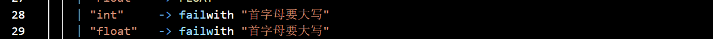
   
   
2. 测试

   测试代码

   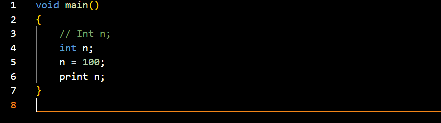

类型首字母大写测试

如果类型首字母小写，将出现报错

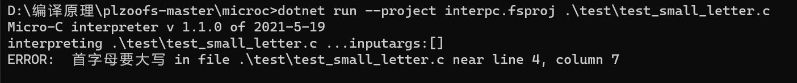

如果首字母大写（代码的注释部分），输出100

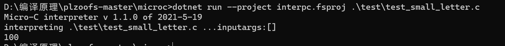

#### 2. 实现自定义注释 （  （*   *）），关键代码与步骤如下

1. 实现
   修改Clex.fls文件。

   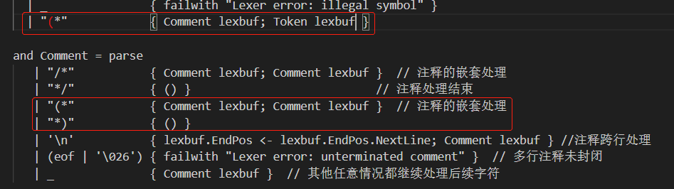
2. 测试

   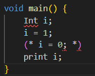

   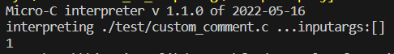

#### 3. 未完全实现Float类型，部分关键代码与步骤如下

1. 实验
   在Absyn.fs中增加float类型

   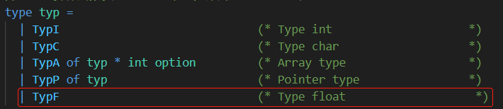
   在Clex.fsl 中增加关键词信息FLOAT、正则表达式提取浮点数

   增加CPar.fsy中token的定义、FLOAT类型

   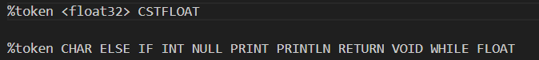

   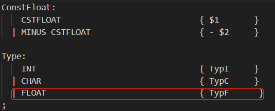

   在interp.fs中增加第三种print类型，并在CPar.fsy中声明

   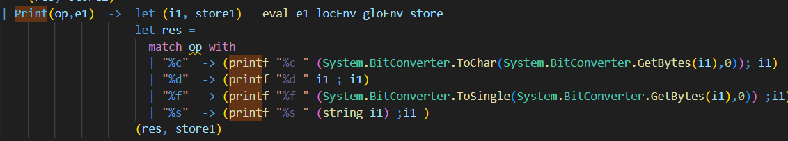

   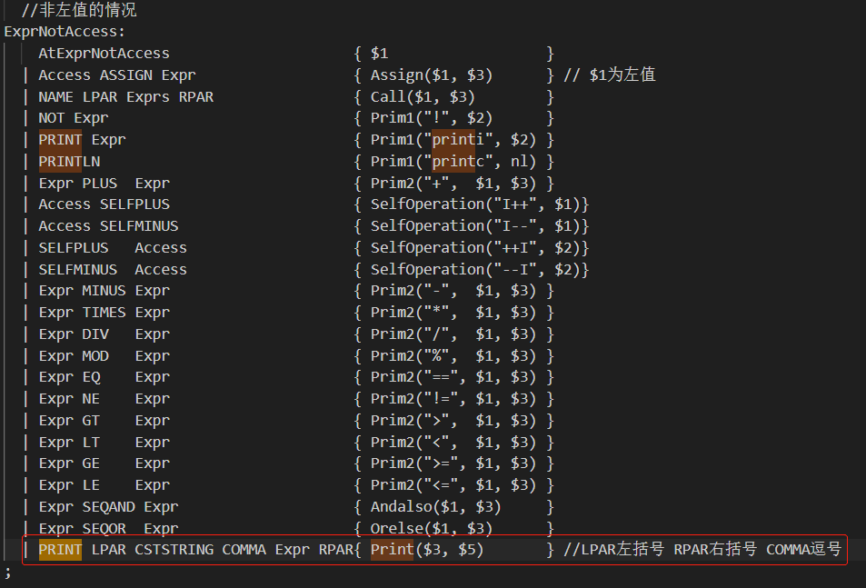
2. 测试

   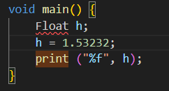

   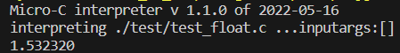

   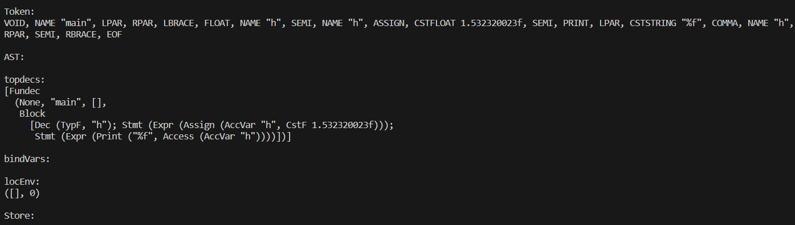

#### 4.解决自增自减运算符（i++,i--,--i,++i）问题，关键代码与步骤如下

1. 实现

   1. 在Absyn.fs中添加表达式

      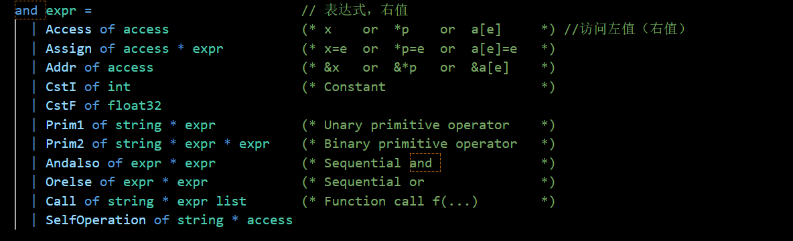

      2.在CLex.fsl中添加 ++ 和 -- 的词法

      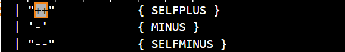

   3.在CPar.fsy中添加token：SELFPLUS、 SELFMINUS；运算优先级；非左值情况定义

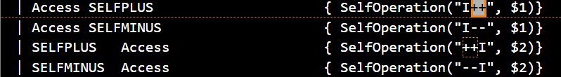

    4.测试代码


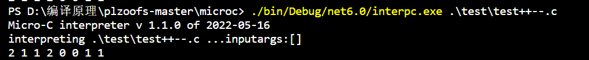

#### 5.解决 +=，-=，*=，/= 问题，关键代码与步骤如下

1. 实现

   1. 在Clex.fsl中加入新规则

      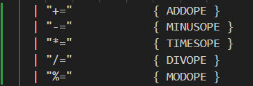
   2. CPar.fsy中定义token，增加非左值情况。

      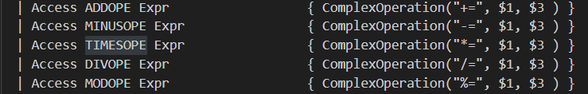
   3. 在Absyn.fs中加入新的expr

      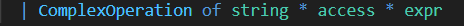
   4. Interp.c中加入新的eval

      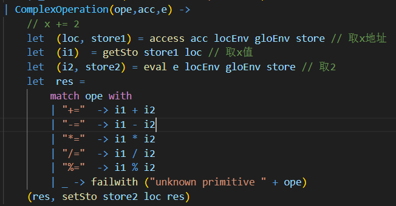
2. 测试

   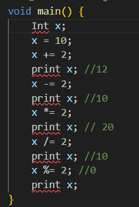

   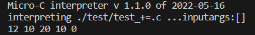

   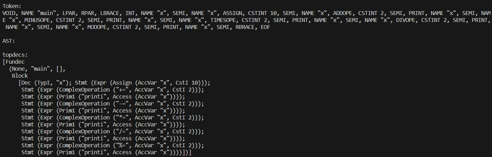

#### 6.解决Switch Case问题，关键代码与步骤如下

1. 实现

   在CLex.fsl中新增

   

   在CPar.fsy中新增token(SWITCH、CASE、DEFAULT);

   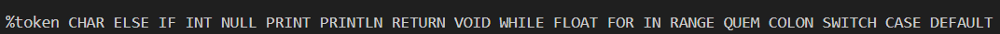

   1. 增加StmtM

      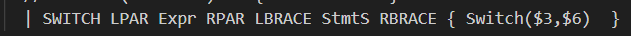
   2. 增加StmtS

      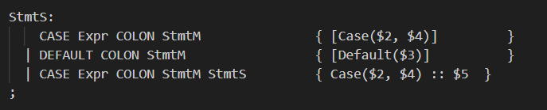

   在Absyn.fs中

   1. 新增stmt

      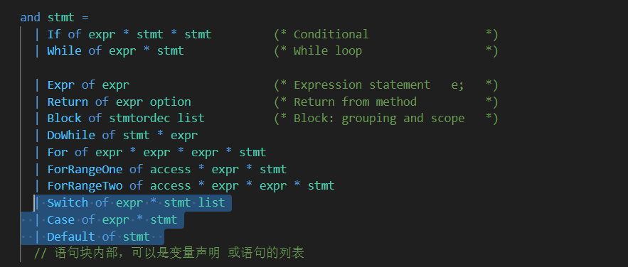

   在Interp.c中加入新的exec

   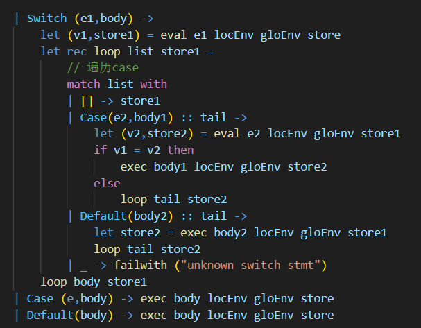
2. 测试

   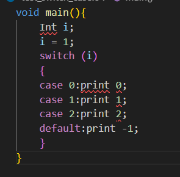

   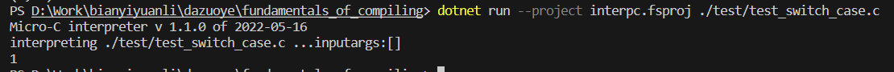

   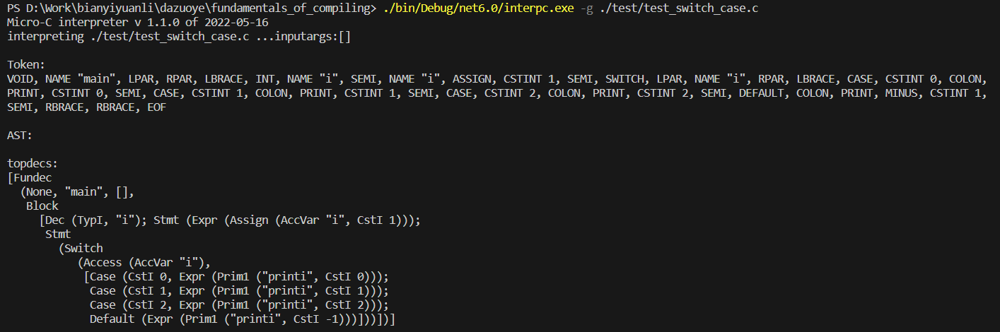

#### 7.解决Do While问题，关键代码与步骤如下

1. 实现

   1. 在CLex.fsl中新增

      ```F#
      | "do"      -> DO
      ```
   2. 在CPar.fsy中新增token(DO);

      1. 增加StmtM

      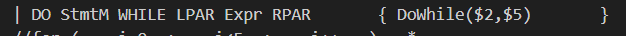
   3. 在Absyn.fs中

      1. 新增stmt

         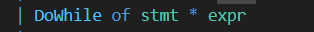
   4. 在Interp.c中加入新的exec

   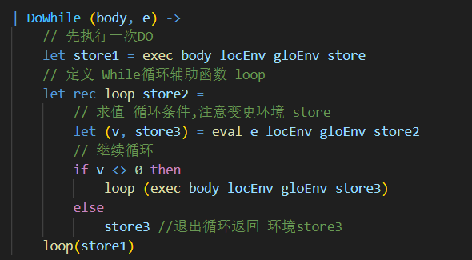
2. 测试

   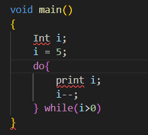

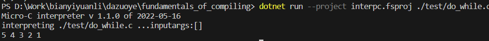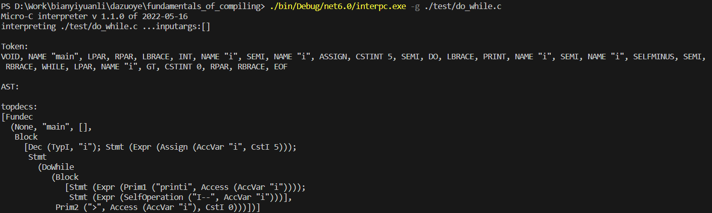

#### 8.解决Do Until问题，关键代码与步骤如下

1. 实现
   1. 在CLex.fsl中新增

      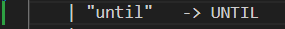
   2. 在CPar.fsy中新增token(UNTIL);

      1. 增加StmtM

         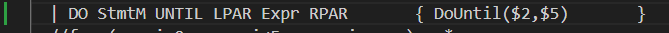
   3. 在Absyn.fs中

      1. 新增stmt

      
   4. 在Interp.c中加入新的exec

      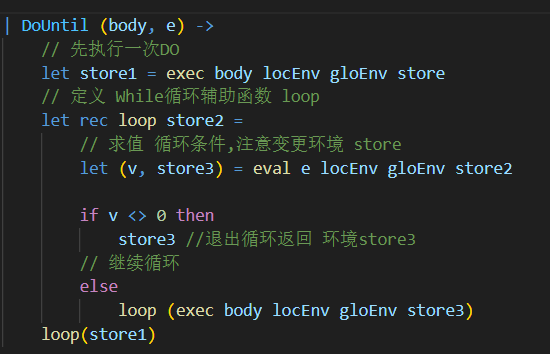
2. 测试

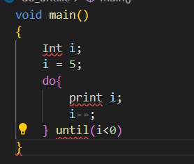

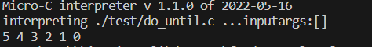

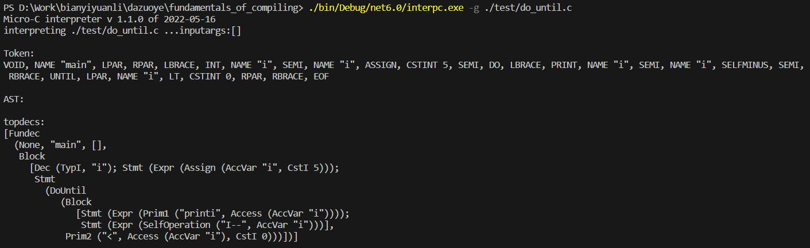

#### 9.利用正则表达式完善变量名检查

测试代码

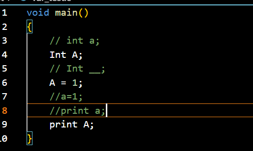 

如果变量名大写开头将报错

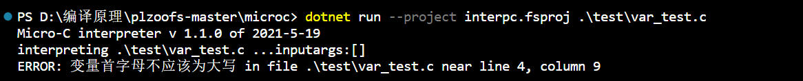

同理，如果以__开头也会报错

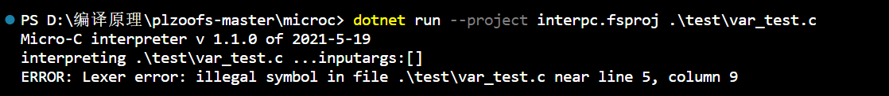

#### 10.三目运算符

1.Clex.fsl加入新规则

```
  | ':'             { COLON }
  | '?'             { QUEM }
```

2.Cpar.fsy中定义语法表达式

```
  | Expr QUEM Expr COLON Expr           { Prim3($1,$3,$5)     }
```

3.Absyn.fs中加入新的语句对象

```
| Prim3 of expr * expr * expr
```

4.Interp.fs加入新的eval

    | Prim3(e1,e2,e3) ->
        let (v1,store1) = eval e1 locEnv gloEnv store
        let (v2,store2) = eval e2 locEnv gloEnv store1
        let (v3,store3) = eval e3 locEnv gloEnv store2
        if v1<> 0 then
            (v2,store2)
        else
            (v3,store3)

测试代码

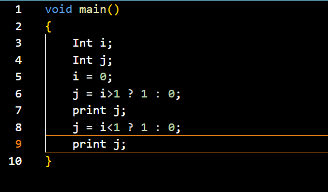 


### 11.for ( i=0; i<5; i++)

1.在clex.fsi中

 

2. CPar.fsy中定义token(FOR) 和StmtM;

   

3. Absyn.fs中加入新的stmt

   ```
   For of expr * expr * expr * stmt  
   ```

   

4. Interp.c中加入新的exec

```
    | For (e1, e2, e3, body) ->
        let (v, store1) = eval e1 locEnv gloEnv store
        let rec loop store1 = 
            let (v, store2) = eval e2 locEnv gloEnv store1
            if v<>0 then
                // 执行内部 语句
                let store3 = exec body locEnv gloEnv store2
                // i++
                let (tmp, store4) = eval e3 locEnv gloEnv store3
                loop store4
            else store2
        loop store1
```

测试代码

 

结果


### 12.for  i in range(n)

1. 在CLex.fsl中新增

    

2. 在CPar.fsy中新增token(IN RANGE); 和StmtM

   

3. Absyn.fs中新增stmt

   ```
   | ForRangeOne of access * expr * stmt
   ```

   

4. 在Interp.c中加入新的exec

   ```
       | ForRangeOne (e1, e2, body) ->
           let (max,store) = eval e2 locEnv gloEnv store
           let (loc, store1) = access e1 locEnv gloEnv store
           // 赋初值
           let store2 = setSto store1 loc 0
           let rec loop store2 = 
               let i = getSto store2 loc
               if i<max then
                   let store3 = exec body locEnv gloEnv store2
                   let store4 = setSto store3 loc (i+1)
                   loop store4
               else store2
           loop store2
   ```

 测试代码

 

结果


### 13.for  i in range(n,m)

1.在CPar.fsy中新增token(IN RANGE); 和StmtM


2.Absyn.fs中新增stmt

```
| ForRangeTwo of access * expr * expr * stmt
```

3.在Interp.c中加入新的exec

```
     | ForRangeTwo (e1, e2, e3, body) ->
        let (start,store) = eval e2 locEnv gloEnv store
        let (last,store) = eval e3 locEnv gloEnv store
        let (loc, store1) = access e1 locEnv gloEnv store
        let store2 = setSto store1 loc start
        let rec loop store2 = 
            let i = getSto store2 loc
            if i<last then
                let store3 = exec body locEnv gloEnv store2
                let store4 = setSto store3 loc (i+1)
                loop store4
            else store2
        loop store2
```

测试代码

 


#### 14.for  i in range(n,m,s)

1.在CPar.fsy中新增token(IN RANGE); 和StmtM


2.Absyn.fs中新增stmt

```
| ForRangeThree of access * expr * expr * expr * stmt
```

3.在Interp.c中加入新的exec

```
    | ForRangeThree (e1, e2, e3, e4, body) ->
        let (start,store) = eval e2 locEnv gloEnv store
        let (last,store) = eval e3 locEnv gloEnv store
        let (step,store) = eval e4 locEnv gloEnv store
        let (loc, store1) = access e1 locEnv gloEnv store

        let store2 = setSto store1 loc start
        let rec loop store2 = 
            let i = getSto store2 loc
            if i<last then
                let store3 = exec body locEnv gloEnv store2
                let store4 = setSto store3 loc (i+step)
                loop store4
            else store2
        loop store2
```

测试

 

结果


### 编译器

#### 1.实现自增自减++--

在Comp.fs中


```
void main()
{
    Int a;
    a = 1;
    print ++a;
    print a;
    a = 1;
    print --a;
    print a;
    a = 1;
    print a++;
    print a;
    a = 1;
    print a--;
    print a;
}
```


#### 2.三目运算

在comp.fs中

 

```
void main()
{
    Int i;
    Int j;
    i = 0;
    j = i>1 ? 1 : 0;
    print j;
    j = i<1 ? 1 : 0;
    print j;
}
```


#### 3.for (i=0;i<5;i++)

1.在comp.fs加入

 

测试


#### 4.for i in range(n)

1.在comp.fs加入

 

测试


### 

#### 5.解决 +=，-=，*=，/= 问题，关键代码与步骤如下

1. 实现

   在comp中加入cExpr

   
2. 测试


#### 6.解决Switch Case问题，关键代码与步骤如下

1. 实验

#### 7.解决Do While问题，关键代码与步骤如下

1. 实验

   
2. 测试


#### 8.解决Do Until问题，关键代码与步骤如下

1. 实验

   
2. 测试


#### 9.for i in range(n,m)

1.在comp.fs加入

 

测试


#### 10.for i in range(n,m)

1.在comp.fs加入

 

测试


# 

# 心得体会

+ 大作业开发过程心得
+ 本课程建议
