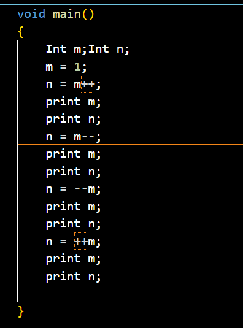

# 2020-2021学年第2学期

## 实 验 报 告


* 课程名称：编程语言原理与变异
* 实验项目：期末大作业
* 专业班级：计算机2001
* 学生学号：32001111、32001128
* 学生姓名：陈家鹏、吴书雨
* 实验指导教师：郭鸣

| 学号     | 姓名   | 班级       | 权重 | 任务     |
| -------- | ------ | ---------- | ---- | -------- |
| 32001111 | 陈家鹏 | 计算机2001 | 0.95 | 见GitHub |
| 32001128 | 吴书雨 | 计算机2001 | 0.95 | 见GitHub |

## 项目自评等级:(1-5) 请根据自己项目情况填写下表

| 词法                                     | 评分       | 备注 |
| ---------------------------------------- | ---------- | ---- |
| 类型名称以大写开头                       | ⭐⭐⭐⭐⭐ |      |
| 变量名以小写开头                         |            |      |
| 两个下划线开头的名字__是内部保留，不允许 |            |      |
| 注释（* *）                              | ⭐⭐       |      |
| Float                                    | ⭐         |      |

| 语法            | 评分     | 备注 |
| --------------- | -------- | ---- |
| I++ I-- ++I --I | ⭐⭐⭐⭐ |      |
| += -= *= /= %=  |          |      |

## 项目说明

+ 项目 是基于现有的microc代码

  - 改进 xxx模块 功能1
  - 改进 xxx模块 功能2
  - 。。。。

- 项目 独立开发
  - 独立开发了 xx 模块
  - 。。。。

## 解决技术要点说明

### 解释器

#### 1. 解决类型检查，关键代码与步骤如下

类型首字母大写通过自定义匹配实现，变量首字母大写通过正则表达式判断，

1. 步骤

   + 修改Clex.fsl 中关键词信息，正则表达式匹配首字母大写变量

   
2. 测试

   测试代码

   

类型首字母大写测试

如果类型首字母小写，将出现报错


如果首字母大写（代码的注释部分），输出100


#### 2. 实现自定义注释 （  （*   *）），关键代码与步骤如下

1. 实现
   修改Clex.fls文件。

   
2. 测试

   

   

#### 3. 未完全实现Float类型，部分关键代码与步骤如下

1. 实验
   在Absyn.fs中增加float类型

   
   在Clex.fsl 中增加关键词信息FLOAT、正则表达式提取浮点数

   增加CPar.fsy中token的定义、FLOAT类型

   

   

   在interp.fs中增加第三种print类型，并在CPar.fsy中声明

   

   
2. 测试

   

   

   

#### 4.解决自增自减运算符（i++,i--,--i,++i）问题，关键代码与步骤如下

1. 实现

   1. 在Absyn.fs中添加表达式

      

      2.在CLex.fsl中添加 ++ 和 -- 的词法

      

   3.在CPar.fsy中添加token：SELFPLUS、 SELFMINUS；运算优先级；非左值情况定义


    4.测试代码

    


#### 5.解决 +=，-=，*=，/= 问题，关键代码与步骤如下

1. 实现

   1. 在Clex.fsl中加入新规则

      
   2. CPar.fsy中定义token，增加非左值情况。

      
   3. 在Absyn.fs中加入新的expr

      
   4. Interp.c中加入新的eval

      
2. 测试

   

   

   

#### 6.解决Switch Case问题，关键代码与步骤如下

1. 实现

   在CLex.fsl中新增

   

   在CPar.fsy中新增token(SWITCH、CASE、DEFAULT);

   

   1. 增加StmtM

      
   2. 增加StmtS

      

   在Absyn.fs中

   1. 新增stmt

      

   在Interp.c中加入新的exec

   
2. 测试

   

   

   


#### 7.解决Do While问题，关键代码与步骤如下

1. 实现

   1. 在CLex.fsl中新增

      ```F#
      | "do"      -> DO
      ```
   2. 在CPar.fsy中新增token(DO);

      1. 增加StmtM

      
   3. 在Absyn.fs中

      1. 新增stmt

         
   4. 在Interp.c中加入新的exec

   
2. 测试

    


#### 8.解决Do Until问题，关键代码与步骤如下

1. 实现
   1. 在CLex.fsl中新增

      
   2. 在CPar.fsy中新增token(UNTIL);

      1. 增加StmtM

         
   3. 在Absyn.fs中

      1. 新增stmt

      
   4. 在Interp.c中加入新的exec

      
2. 测试


### 编译器

#### 5.解决 +=，-=，*=，/= 问题，关键代码与步骤如下

1. 实现

   在comp中加入cExpr

   
2. 测试

# 心得体会

+ 大作业开发过程心得
+ 本课程建议
